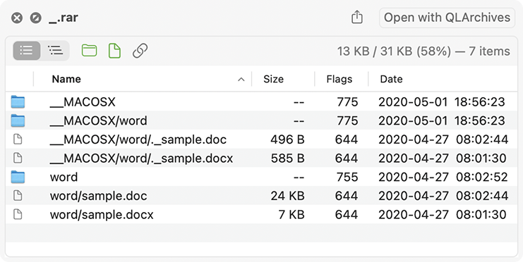
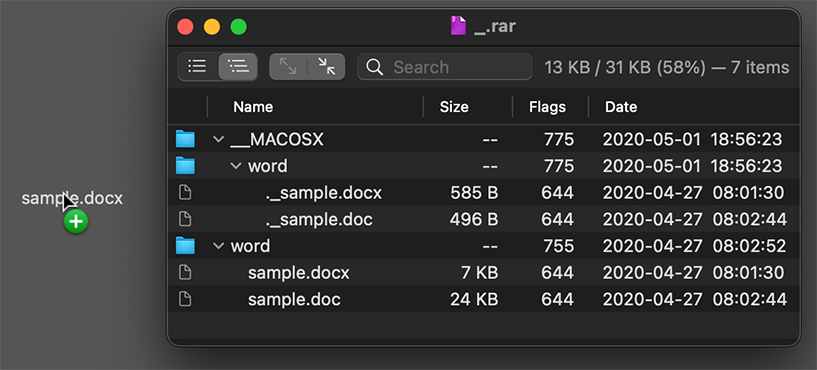

[](#)
[](https://github.com/relikd/QLArchives/releases/latest)
[](https://github.com/relikd/QLArchives/releases)


QLArchives
==========

QuickLook plugin for archive formats.




Installation
------------

Requires macOS Catalina (10.15) or higher.

```sh
brew install --cask relikd/tap/qlarchives
xattr -d com.apple.quarantine /Applications/QLArchives.app
```

or download from [releases](https://github.com/relikd/QLArchives/releases/latest).


Features
--------

- Blazing fast archive listings (native UI)
- No (external) dependencies
- macOS 10.15+
- Small app size (2 MB)
- Customize sort order
- Filter by filetype
- Archive support for: `.7z`, `.apk`, `.cab`, `.cdr`, `.cpio`, `.deb`, `.epub`, `.ipsw`, `.iso`, `.jar`, `.lha`, `.pkg`, `.rar`, `.rpm`, `.tar`, `.tar.bz2`, `.tar.gz`, `.tar.lz`, `.tar.xz`, `.tbz`, `.tbz2`, `.tgz`, `.tlz`, `.txz`, `.war`, `.xar`, `.xip`, `.zip`, `.zipx`

### Within the companion app
- Search for files
- Extract individual files from archive



### ToDo List
- "Extract all" button
- UI config options for `resolveSymlinks` and `autoExpand`


Hidden settings
---------------

Hopefully replaced by UI settings soon:

```sh
defaults write de.relikd.QLArchives.preview resolveSymlinks -bool YES
defaults write de.relikd.QLArchives.preview autoExpand -bool YES
defaults write de.relikd.QLArchives resolveSymlinks -bool YES
defaults write de.relikd.QLArchives autoExpand -bool YES
```

Change config to a) show symlink targets, and b) start tree view with all nodes expanded.
The `.preview` options are for the QuickLook preview, the latter for the companion app.


What it does
------------

QLArchives uses [libarchive](https://github.com/libarchive/libarchive) to process most common archive formats.
Notably, the app uses the libarchive library already bundled with macOS.


### MacOS libarchive versions

- macOS 10.13.2: libarchive 2.8.3 (NO SUPPORT)
- macOS 10.14.6: libarchive 2.8.3 (NO SUPPORT)
- macOS 10.15.7: libarchive 3.3.2 (NOT: pkg, xar, xip)
- macOS 11.7.8: libarchive 3.3.2 (NOT: pkg, xar, xip)
- macOS 12.6.1: libarchive 3.5.1
- macOS 13.6.1: libarchive 3.5.3
- macOS 14.6.1: libarchive 3.5.3
- macOS 15.6.1: libarchive 3.7.4
- macOS 26.3.1: libarchive 3.7.4


### Limitations

For reasons unknown, libarchive could also process `.lrz`, `.lz4`, `.zst` but macOS throws an error.

```
ERROR: Can't initialize filter; unable to run program "lrzip -d -q"
ERROR: Can't initialize filter; unable to run program "lz4 -d -q"
ERROR: Can't initialize filter; unable to run program "zstd -d -qq"
```
